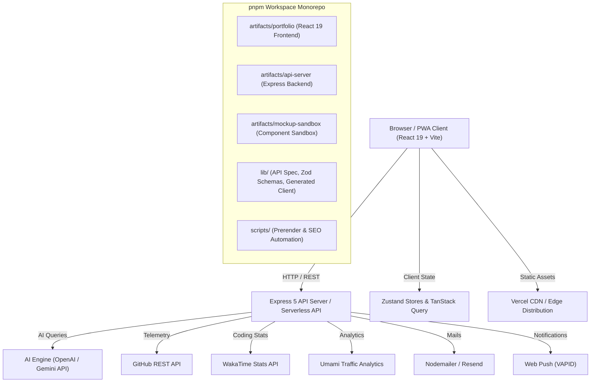

# 🚀 Imran Digitals — Portfolio & Digital Agency Platform

[](https://www.typescriptlang.org/)
[](https://react.dev/)
[](https://vitejs.dev/)
[](https://tailwindcss.com/)
[](https://expressjs.com/)
[](https://web.dev/progressive-web-apps/)
[](LICENSE)

> A modern, high-performance, full-stack web development agency and personal portfolio platform for **Imran Digitals**. Built with a **pnpm monorepo architecture**, featuring serverless Express 5 API endpoints, AI-powered conversational assistance (**SmartTalk**), live developer telemetry (WakaTime & GitHub), SEO-prerendered dynamic pages, and a Progressive Web App (PWA) experience.

---

## 📑 Table of Contents

- [🌟 Key Features](#-key-features)
- [🏗️ High-Level Architecture](#️-high-level-architecture)
- [📁 Project Directory Structure](#-project-directory-structure)
- [🖥️ Frontend Deep Dive (`artifacts/portfolio`)](#️-frontend-deep-dive-artifactsportfolio)
  - [Routes & Pages](#routes--pages)
  - [Layout & Navigation](#layout--navigation)
  - [Design System & UI Primitives](#design-system--ui-primitives)
  - [SEO & Structured Data](#seo--structured-data)
  - [PWA & Offline Experience](#pwa--offline-experience)
  - [Internationalization (i18n)](#internationalization-i18n)
- [⚙️ Backend API Deep Dive (`artifacts/api-server`)](#️-backend-api-deep-dive-artifactsapi-server)
  - [API Endpoints](#api-endpoints)
- [📦 Shared Monorepo Packages (`lib/`)](#-shared-monorepo-packages-lib)
- [🛠️ Tech Stack Matrix](#️-tech-stack-matrix)
- [🚀 Getting Started](#-getting-started)
  - [Prerequisites](#prerequisites)
  - [Installation](#installation)
  - [Environment Variables](#environment-variables)
  - [Development Scripts](#development-scripts)
- [🚢 Deployment Pipeline](#-deployment-pipeline)
- [📄 License & Author](#-license--author)

---

## 🌟 Key Features

- **⚡ Lightning-Fast Performance**: Built with React 19, Vite, Tailwind CSS v4, and automated static HTML pre-rendering (`prerender.mjs`) for near-perfect Lighthouse scores (95+ across Performance, Accessibility, Best Practices, and SEO).
- **🤖 SmartTalk AI Assistant**: Full-featured conversational AI chatbot with real-time streaming, context-aware prompt processing, audio/voice interface capabilities, and intelligent customer lead capture.
- **📊 Live Developer Telemetry Dashboard**: Real-time integration with **GitHub API** (live repo stats, contribution graph) and **WakaTime API** (real-time coding hours, top languages, editor breakdown), plus **Umami Analytics** web metrics.
- **🔍 Advanced Technical & Local SEO**: Automated JSON-LD structured data (`Person`, `ProfessionalService`, `LocalBusiness`, `BreadcrumbList`, `FAQPage`, `Article`), dynamic meta tags, OpenGraph/Twitter card generators, and geo-targeted landing pages (Multan, Lahore, Islamabad, USA, UK, etc.).
- **📱 Progressive Web App (PWA)**: Web app manifest, custom Service Worker with cache strategies, installable app prompts, and Web Push notifications (VAPID).
- **🎨 Glassmorphism & Modern UI**: Dark & Light theme system with persistence, soft glows, responsive dual navigation (Collapsible Sidebar for Desktop & Floating BottomNav for Mobile), and micro-interactions powered by Framer Motion.
- **💼 Interactive Case Studies & Projects**: Filterable project showcase with comprehensive deep-dive case studies, architecture diagrams, live previews, and technology stacks.
- **🌐 Internationalization (i18n)**: Multi-language support structure with locale switching (English, Urdu, and more).
- **🔒 Admin Management Portal**: Secure portal to oversee incoming quote inquiries, client feedback, push notification subscriptions, and system metrics.

---

## 🏗️ High-Level Architecture



---

## 📁 Project Directory Structure

```
new-portfolio/
├── .env.example                     # Environment variables template
├── .gitignore                       # Git ignore rules
├── CLAUDE.md                        # AI agent development & SEO standards
├── README.md                        # Master project documentation
├── package.json                     # Root workspace configuration & scripts
├── pnpm-lock.yaml                   # Monorepo dependency lockfile
├── pnpm-workspace.yaml              # pnpm workspace definition
├── tsconfig.base.json               # Shared TypeScript compiler configuration
├── tsconfig.json                    # Root TypeScript configuration
├── vercel.json                      # Vercel deployment routing & rewrites
│
├── api/                             # Bundled serverless functions for deployment
│   └── app.mjs                      # Compiled Express server entrypoint
│
├── artifacts/                       # Main workspace applications
│   ├── portfolio/                   # 🌟 Main React 19 Frontend Application
│   │   ├── index.html               # Frontend HTML root
│   │   ├── package.json             # Frontend dependencies & scripts
│   │   ├── vite.config.ts           # Vite build & plugin configuration
│   │   ├── tsconfig.json            # Frontend TypeScript config
│   │   ├── scripts/                 # Static site generation & SEO scripts
│   │   │   ├── prerender.mjs        # Automated route pre-renderer (SSG)
│   │   │   └── standardize_seo.mjs  # SEO verification & schema generator
│   │   └── src/
│   │       ├── App.tsx              # Main application router & layout orchestrator
│   │       ├── main.tsx             # Application bootstrap & DOM root
│   │       ├── index.css            # Tailwind CSS v4 & theme variables
│   │       ├── components/          # Reusable component library
│   │       │   ├── chat/            # Chat widget & conversation popover
│   │       │   ├── layout/          # Sidebar, BottomNav, PageLayout, SiteFooter
│   │       │   ├── ui/              # 50+ Radix UI + Tailwind design primitives
│   │       │   ├── FloatingActions.tsx # Back-to-top, theme toggle, quick action pill
│   │       │   ├── PWAInstallButton.tsx # PWA install action button
│   │       │   ├── PWAInstallPrompt.tsx # PWA installation prompt banner
│   │       │   ├── SEOHead.tsx      # Dynamic SEO meta & JSON-LD schema injector
│   │       │   └── WakaTimeSetupModal.tsx # WakaTime key integration modal
│   │       ├── data/                # Static data models, content & case studies
│   │       │   ├── blog.ts          # Technical articles & blog entries
│   │       │   ├── case-studies.ts  # In-depth client case study dossiers
│   │       │   ├── locations.ts     # Local SEO location targets & metadata
│   │       │   ├── personal.ts      # Developer bio, skills, tools & experience
│   │       │   ├── projectDetails.ts # Project showcase database
│   │       │   ├── services.ts      # Agency service catalogue & pricing tiers
│   │       │   └── portfolioContext.ts # Context data for AI SmartTalk prompt
│   │       ├── hooks/               # Custom React hooks
│   │       │   ├── use-mobile.tsx   # Responsive viewport breakpoint detection
│   │       │   ├── use-toast.ts     # Toast notification state hook
│   │       │   └── usePushNotifications.ts # Service worker & Web Push hook
│   │       ├── lib/                 # Client utilities and helpers
│   │       │   ├── consultation.ts  # Consultation booking logic & calculations
│   │       │   ├── firebase.ts      # Firebase configuration & client
│   │       │   ├── i18n.ts          # Translation dictionaries & language hook
│   │       │   ├── image-optimization.ts # Responsive image & WebP helper
│   │       │   ├── theme.ts         # Theme initialization & switching
│   │       │   └── utils.ts         # Tailwind class merger (clsx + twMerge)
│   │       ├── pages/               # Application page routes (19 pages)
│   │       └── stores/              # Zustand global client state stores
│   │
│   ├── api-server/                  # ⚙️ Express 5 Backend Server
│   │   ├── build.mjs                # esbuild bundle script for API
│   │   ├── package.json             # Backend dependencies
│   │   ├── tsconfig.json            # Backend TypeScript config
│   │   └── src/
│   │       ├── index.ts             # Local HTTP server entrypoint
│   │       ├── app.ts               # Express application initialization & middleware
│   │       ├── middlewares/         # Logging (Pino), CORS, error handling
│   │       ├── lib/                 # Server helpers (mailer, push utils, AI)
│   │       └── routes/              # Modular Express route handlers
│   │           ├── email.ts         # Contact form mailer (Nodemailer / Resend)
│   │           ├── github.ts        # GitHub stats & repo proxy
│   │           ├── health.ts        # Health check endpoint (`/api/health`)
│   │           ├── push.ts          # Push notification subscription management
│   │           ├── smarttalk.ts     # AI conversational engine & audio streaming
│   │           ├── umami.ts         # Umami analytics proxy
│   │           └── wakatime.ts      # WakaTime coding stats integration
│   │
│   └── mockup-sandbox/              # 🧪 Component preview & sandbox workspace
│       ├── index.html               # Mockup viewer root
│       ├── package.json             # Sandbox dependencies
│       └── vite.config.ts           # Sandbox Vite configuration
│
├── lib/                             # 📦 Shared Monorepo Packages
│   ├── api-client-react/            # Generated React Query hooks for API
│   ├── api-spec/                    # OpenAPI specification definitions
│   ├── api-zod/                     # Shared Zod validation schemas
│   └── db/                          # Database connection & shared schemas
│
└── scripts/                         # 🛠️ Workspace-level build & maintenance scripts
    ├── package.json
    ├── post-merge.sh
    └── src/
```

---

## 🖥️ Frontend Deep Dive (`artifacts/portfolio`)

### Routes & Pages

The frontend uses lightweight, declarative client routing via `wouter` with route-level code splitting (`React.lazy` + `Suspense`).

| Route | Component | Description & Key Features |
|---|---|---|
| `/` | `HomePage` | Hero section, animated headline, featured projects preview, technology marquee, services overview, client reviews, and primary call-to-action (CTA). |
| `/about` | `AboutPage` | Biography, background story, career journey timeline, core principles, skills matrix, and professional certifications. |
| `/dev-profile` | `DevProfilePage` | Deep technical dossier: live GitHub activity graph, WakaTime code statistics, hardware/IDE workstation specs, and dev philosophy. |
| `/achievements` | `AchievementsPage` | Verified client milestones, performance metrics, project completions, and awards. |
| `/projects` | `ProjectsPage` | Interactive filterable project catalog (categorized by Web, Mobile, Full-Stack, AI, and Extensions). |
| `/projects/:slug` | `ProjectDetailPage` | Detailed case study with architecture breakdown, challenge/solution analysis, tech stack tags, live preview, and source code links. |
| `/services` | `ServicesIndexPage` | Full agency service catalogue with scope descriptions, pricing tiers, deliverables, and FAQ accordion. |
| `/services/:slug` | `ServicePage` | Dedicated landing page for individual services (e.g., MERN Stack, React/Next.js, AI Integrations, Technical SEO, Speed Optimization). |
| `/locations` | `LocationsIndexPage` | Geo-targeted service directory index for regional and international client acquisition. |
| `/locations/:slug` | `LocationPage` | Local SEO landing pages with regional targeting (e.g., Multan, Lahore, Islamabad, USA, UK, Canada, Australia). |
| `/dashboard` | `DashboardPage` | Live interactive analytics dashboard: GitHub metrics, real-time WakaTime coding telemetry, Umami traffic graphs, and Lighthouse score monitors. |
| `/blog` | `BlogIndexPage` | Engineering blog and article directory featuring search, tag filters, and reading time estimates. |
| `/blog/:slug` | `BlogPostPage` | Full article view with syntax-highlighted code snippets, table of contents, author card, and schema markup. |
| `/smarttalk` | `SmartTalkPage` | Interactive AI assistant interface supporting real-time text, voice/audio conversation, and intelligent portfolio Q&A. |
| `/chat` | `ChatRoomPage` | Real-time direct messaging room for client consultations and project inquiries. |
| `/contact` | `ContactPage` | Project consultation scheduler, instant quote estimator, email inquiry form, and direct contact methods (WhatsApp, Email, LinkedIn). |
| `/feedback` | `FeedbackPage` | Client testimonials, review submission form, and interactive star rating breakdown. |
| `/admin` | `AdminPage` | Secure administration dashboard for managing inquiries, feedbacks, push notifications, and settings. |
| `*` | `not-found.tsx` | Custom 404 error page with navigation fallback options. |

### Layout & Navigation

- **Desktop Experience (`Sidebar.tsx`)**: Responsive sticky sidebar featuring user profile avatar, active status indicator, language selector, theme toggle, social links, and structured navigation groups.
- **Mobile Experience (`BottomNav.tsx`)**: Ergonomic floating bottom navigation bar with active route indicators and quick action triggers.
- **Page Transitions & Pagination (`NextPageButton.tsx`)**: Smooth inter-page pagination links facilitating seamless exploration across sequential portfolio pages.
- **Floating Controls (`FloatingActions.tsx`)**: Quick-access floating action pill for one-click "Back to Top", theme toggle, and direct consultation booking.

### Design System & UI Primitives

All UI components reside in `artifacts/portfolio/src/components/ui/` and are built using **Radix UI** unstyled accessible primitives styled with **Tailwind CSS v4**:

- **Inputs & Forms**: `form.tsx`, `input.tsx`, `input-otp.tsx`, `textarea.tsx`, `select.tsx`, `checkbox.tsx`, `radio-group.tsx`, `switch.tsx`, `slider.tsx`.
- **Navigation & Menus**: `navigation-menu.tsx`, `dropdown-menu.tsx`, `context-menu.tsx`, `menubar.tsx`, `breadcrumb.tsx`, `tabs.tsx`, `pagination.tsx`.
- **Feedback & Overlays**: `dialog.tsx`, `alert-dialog.tsx`, `drawer.tsx`, `sheet.tsx`, `popover.tsx`, `tooltip.tsx`, `hover-card.tsx`, `toast.tsx`, `sonner.tsx`.
- **Data & Layout**: `card.tsx`, `table.tsx`, `chart.tsx` (Recharts integration), `carousel.tsx` (Embla Carousel), `accordion.tsx`, `collapsible.tsx`, `scroll-area.tsx`, `resizable.tsx`, `aspect-ratio.tsx`, `avatar.tsx`, `badge.tsx`.
- **Performance Utilities**: `OptimizedImage.tsx` (responsive WebP loader with fallback and blur-up placeholder), `LazyViewport.tsx` (IntersectionObserver viewport lazy loader).

### SEO & Structured Data

Implemented via `SEOHead.tsx` using `react-helmet-async`:
- Dynamic Page Title & Meta Descriptions.
- Canonical URL generation.
- OpenGraph (OG) & Twitter Summary Card tags.
- Dynamic **JSON-LD Schema Markup**:
  - `WebSite` & `WebPage`
  - `Person` & `ProfessionalService`
  - `LocalBusiness`
  - `BreadcrumbList`
  - `FAQPage`
  - `BlogPosting` / `Article`

### PWA & Offline Experience

- **Web App Manifest**: Full metadata for mobile app installation (icons, standalone display mode, theme colors).
- **Service Worker**: Cache-first strategy for static assets and network-first for dynamic API data.
- **Install Banners (`PWAInstallPrompt.tsx`, `PWAInstallButton.tsx`)**: In-app installation prompts when `beforeinstallprompt` event triggers.
- **Web Push Notifications (`usePushNotifications.ts`)**: Client subscription helper communicating with backend VAPID endpoints.

### Internationalization (i18n)

Configured via `artifacts/portfolio/src/lib/i18n.ts`:
- Seamless switching between English, Urdu, and additional locales.
- Type-safe dictionary keys covering Navigation, Hero, Buttons, Forms, Project Cards, and Footer labels.

---

## ⚙️ Backend API Deep Dive (`artifacts/api-server`)

The backend is built with **Express 5** and **TypeScript**, bundled with `build.mjs` into a lightweight, standalone ESM bundle (`api/app.mjs`) compatible with local Node.js environments and Vercel Serverless Functions.

### API Endpoints

| Method | Endpoint | Description | Query / Body Parameters |
|---|---|---|---|
| `GET` | `/api/health` | Health check endpoint returning server status and timestamp. | None |
| `POST` | `/api/email` | Sends consultation inquiry or contact message via Nodemailer / Resend. | `{ name, email, message, service?, budget? }` |
| `POST` | `/api/smarttalk` | Conversational AI endpoint for SmartTalk assistant. Returns context-grounded AI responses. | `{ message, history, context? }` |
| `GET` | `/api/github/stats` | Fetches live GitHub repositories, star count, commit activity, and user profile data. | None |
| `GET` | `/api/wakatime/stats` | Proxies WakaTime API to return daily/weekly coding hours, top languages, and editor stats. | None |
| `GET` | `/api/umami/stats` | Fetches aggregated page views, active visitors, and traffic trends from Umami. | None |
| `POST` | `/api/push/subscribe` | Registers a new Web Push subscription object (endpoint, p256dh, auth keys). | `{ subscription }` |
| `POST` | `/api/push/send` | (Admin) Broadcasts a push notification to registered subscribers. | `{ title, body, url, icon? }` |

---

## 📦 Shared Monorepo Packages (`lib/`)

- **`lib/api-spec`**: OpenAPI 3.0 contract defining routes, parameters, request bodies, and responses.
- **`lib/api-zod`**: Reusable Zod validation schemas used across both client forms and server request validators.
- **`lib/api-client-react`**: Auto-generated type-safe TanStack Query hooks for frontend API consumption.
- **`lib/db`**: Database client abstraction layer and ORM models.

---

## 🛠️ Tech Stack Matrix

| Category | Technologies |
|---|---|
| **Frontend Framework** | [React 19](https://react.dev/), [TypeScript](https://www.typescriptlang.org/), [Vite](https://vitejs.dev/) |
| **Styling & Theme** | [Tailwind CSS v4](https://tailwindcss.com/), [next-themes](https://github.com/pacocoursey/next-themes), Glassmorphic CSS |
| **UI Primitives** | [Radix UI](https://www.radix-ui.com/), [Lucide React](https://lucide.dev/), [React Icons](https://react-icons.github.io/react-icons/) |
| **Routing & State** | [Wouter](https://github.com/molefrog/wouter), [Zustand](https://github.com/pmndrs/zustand), [TanStack Query](https://tanstack.com/query) |
| **Animations & Visuals** | [Framer Motion](https://www.framer.com/motion/), [Recharts](https://recharts.org/), [Embla Carousel](https://www.embla-carousel.com/) |
| **Forms & Validation** | [React Hook Form](https://react-hook-form.com/), [Zod](https://zod.dev/) |
| **Backend & Serverless** | [Express 5](https://expressjs.com/), [Node.js](https://nodejs.org/), [Pino Logger](https://getpino.io/) |
| **AI & LLM Integration** | [OpenAI SDK](https://github.com/openai/openai-node), [Google GenAI SDK](https://github.com/google-gemini/generative-ai-js) |
| **Email & Delivery** | [Nodemailer](https://nodemailer.com/), [Resend SDK](https://resend.com/) |
| **PWA & Notifications** | [Web Push (VAPID)](https://github.com/web-push-libs/web-push), Service Worker API |
| **Tooling & Monorepo** | [pnpm Workspaces](https://pnpm.io/workspaces), [esbuild](https://esbuild.github.io/), [Prettier](https://prettier.io/) |

---

## 🚀 Getting Started

### Prerequisites

- **Node.js**: v18.0.0 or later (v20+ recommended)
- **pnpm**: v8.0.0 or later (`npm install -g pnpm`)
- **Git**: For version control

### Installation

Clone the repository and install all monorepo dependencies:

```bash
git clone https://github.com/newaladdress-ship-it/branded-portfolio.git
cd branded-portfolio
pnpm install
```

### Environment Variables

Copy the template environment file and provide your credentials:

```bash
cp .env.example .env
```

Key environment configurations:

```ini
# WakaTime API Integration (Developer Telemetry)
WAKATIME_API_KEY=your_wakatime_api_key

# Umami Traffic Analytics
UMAMI_WEBSITE_ID=your_umami_website_id
UMAMI_API_KEY=your_umami_api_key

# Web Push Notifications (VAPID Keys)
VAPID_PUBLIC_KEY=your_vapid_public_key
VAPID_PRIVATE_KEY=your_vapid_private_key
VAPID_EMAIL=mailto:contact@imrandigitals.com

# AI SmartTalk Integration
AI_INTEGRATIONS_OPENAI_API_KEY=your_openai_api_key
# or GEMINI_API_KEY=your_gemini_api_key

# Email Sending (Optional)
RESEND_API_KEY=your_resend_api_key
```

### Development Scripts

| Command | Description |
|---|---|
| `pnpm run dev` | Runs the main portfolio frontend application in development mode with HMR (`http://localhost:3000`). |
| `pnpm run typecheck` | Runs TypeScript type checking across all workspace packages and artifacts. |
| `pnpm run build` | Builds the API server bundle, builds the frontend application, executes route pre-rendering (`prerender.mjs`), and bundles distribution files to `/dist` and `/api`. |
| `pnpm --filter @workspace/portfolio run serve` | Previews the production build locally. |

---

## 🚢 Deployment Pipeline

The application is structured for seamless deployment on **Vercel** or any standard Node.js cloud environment:

1. **Vercel Configuration (`vercel.json`)**:
   - Routes static frontend requests to pre-rendered HTML and client assets in `/dist`.
   - Routes `/api/*` requests to the compiled serverless handler in `api/app.mjs`.
2. **Build Pipeline**:
   ```bash
   pnpm run build
   ```
   - Step 1: Type check with `tsc --build`.
   - Step 2: Compile `artifacts/api-server` with `esbuild` -> output to `artifacts/api-server/dist/app.mjs` and copy to `api/app.mjs`.
   - Step 3: Bundle `artifacts/portfolio` with `vite build`.
   - Step 4: Run `node scripts/prerender.mjs` to generate pre-rendered static HTML for critical routes.
   - Step 5: Copy bundled output to root `/dist`.

---

## 📄 License & Author

**Imran Digitals** — Built with precision, performance, and modern web standards.

- **Author**: Imran Digitals Team
- **Location**: Multan, Pakistan (Serving clients worldwide)
- **License**: [MIT License](LICENSE)
